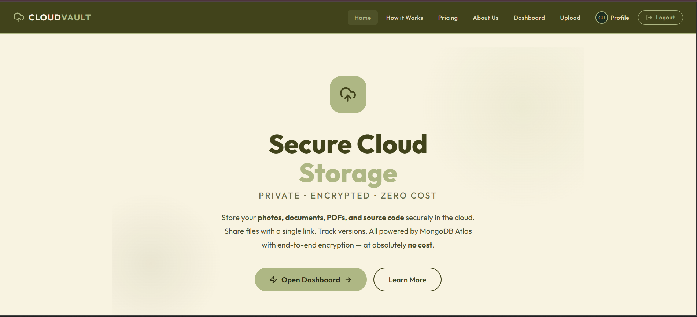
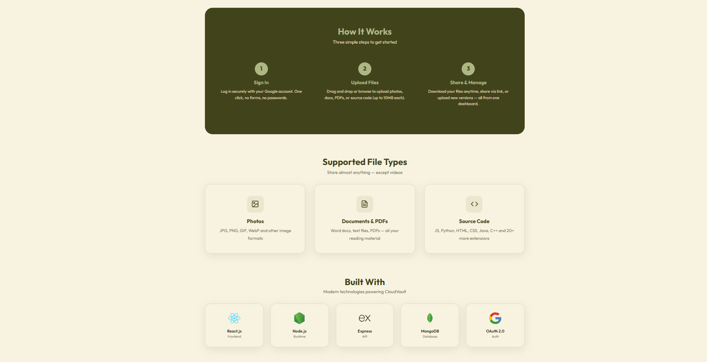
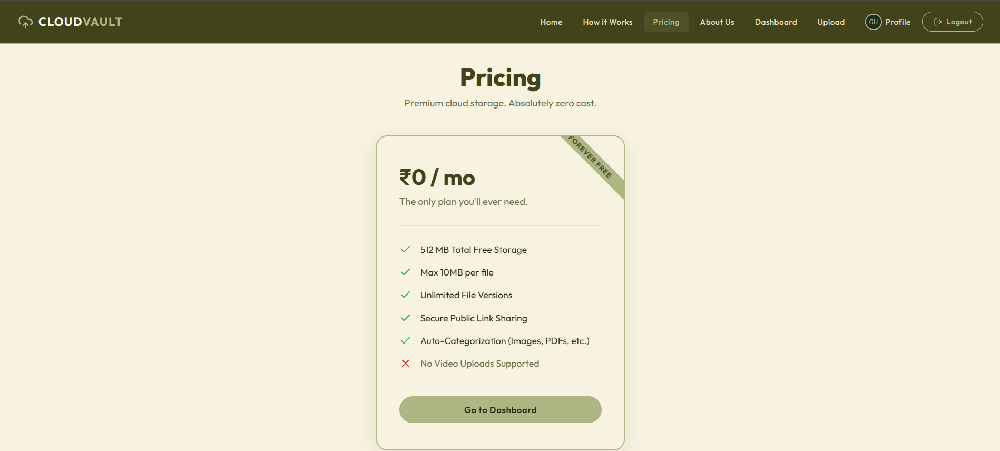
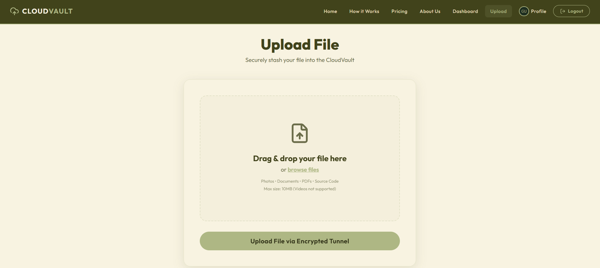

# CloudVault — Secure Cloud Storage App

A premium, secure cloud-based file storage system that allows users to upload, manage, version, and share files safely in the cloud. The application focuses on privacy, zero-password authentication, and an efficient file management experience, featuring a modern glassmorphism UI.

## Project Objective

Build a highly secure cloud storage application similar to Google Drive, featuring seamless Google OAuth 2.0 authentication, automated file versioning, and secure public shareable links.

## 🌟 Features

- **Secure User Authentication**: Zero passwords needed. Utilizes Google OAuth 2.0 for seamless and secure sign-ins.
- **Cloud Storage**: Upload and store files securely using MongoDB Atlas (supporting Photos, PDFs, Documents, and Source Code up to 10MB per file).
- **Automated File Versioning**: Uploading a file with the same name automatically archives the old version and increments the version number.
- **Secure File Sharing**: Generate unique, public download links to share files with anyone, completely bypassing the authentication wall for the receiver.
- **Auto-Categorization**: Files are automatically organized into logical categories based on their MIME types upon upload.
- **Premium UI/UX**: Earthy color palette, glassmorphism panels, and smooth micro-animations built from scratch without CSS frameworks.

## 💻 Tech Stack

**Frontend**
- React.js (Vite)
- React Router DOM
- Vanilla CSS (Custom Design System & Animations)
- Axios & Context API for State Management

**Backend**
- Node.js & Express.js
- MongoDB Atlas & Mongoose
- JSON Web Tokens (JWT) & Cookie Parser
- Passport.js (Google OAuth 2.0 Strategy)
- Multer (File buffering and handling)

## 📸 Application Screenshots

### Home Page


### File Upload Interface


### File Dashboard


### File Sharing


## 🚀 Installation & Local Setup

Since this application is split into a separated frontend and backend, follow these steps to run it locally.

### 1. Clone the repository:
```bash
git clone https://github.com/omkarverse/private-encrypted-storage-app.git
cd private-encrypted-storage-app
